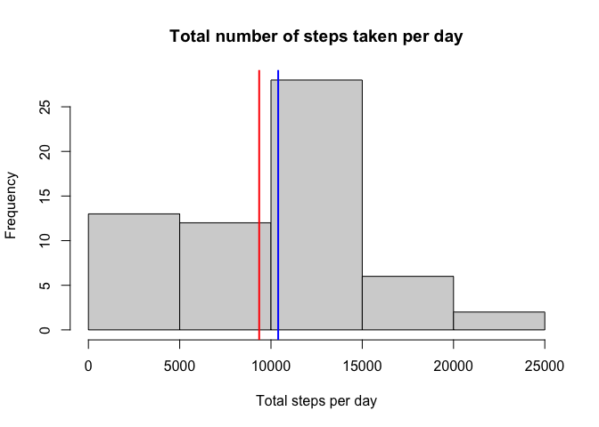
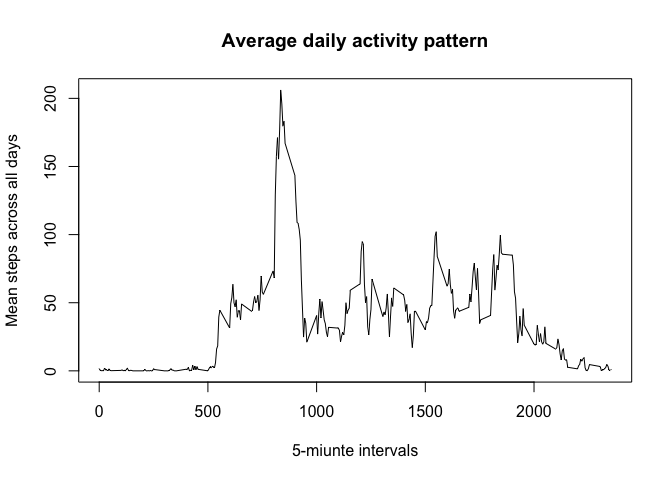
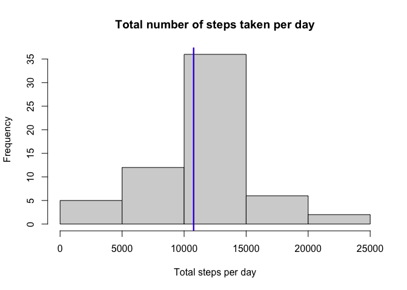
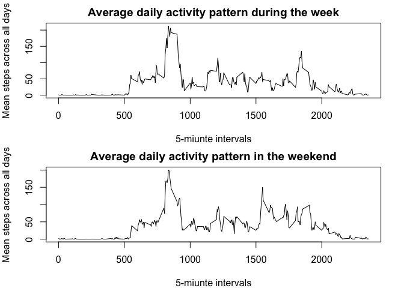

## Loading and preprocessing the data

The data is available in `ZIP` format. This code chunk checks if the data has already been unzipped and if not it unzips it to `activity.csv`. The data is assigned to the object `activity_data`.


```r
if (!file.exists("activity.csv")) {
  unzip("activity.zip")
}
activity_data = read.csv("activity.csv")
```

## What is mean total number of steps taken per day?


```r
library(dplyr, warn.conflicts = FALSE)

# Calculate total number of steps per day
total_steps_per_day <- activity_data %>% 
  group_by(date) %>% 
  summarise(sum = sum(steps, na.rm = TRUE))

# Draw histogram of total number of steps
hist(total_steps_per_day$sum,
     main = "Total number of steps taken per day",
     xlab = "Total steps per day")

# Calculate mean and add it to the histogram
mean_total_steps_per_day <- mean(total_steps_per_day$sum, na.rm = TRUE)
abline(v = mean_total_steps_per_day, col = "red", lwd = 2)

# Calculate median and add it to the histogram
median_total_steps_per_day <- median(total_steps_per_day$sum, na.rm = TRUE) 
abline(v = median_total_steps_per_day, col = "blue", lwd = 2)
```

<!-- -->

As shown in the graph above, the mean total number of steps taken per day is 9354.2295082 and the median is 10395.

## What is the average daily activity pattern?


```r
# Calculate the mean steps per interval across all days
mean_steps_per_interval <- activity_data %>% 
  group_by(interval) %>% 
  summarise(mean = mean(steps, na.rm = TRUE))

# Plot time series of the daily activity pattern
plot(mean_steps_per_interval$interval, mean_steps_per_interval$mean, type = "l",
     main = "Average daily activity pattern",
     xlab = "5-miunte intervals",
     ylab = "Mean steps across all days")
```

<!-- -->

```r
# Calculate the 5-minunte interval with maximum amount of average steps
max_interval <- 
  mean_steps_per_interval[mean_steps_per_interval$mean == max(mean_steps_per_interval$mean), ]
```

As shown in the time series plot above, the activity pattern spikes at a maximum of 206.1698113 steps in the 835 interval, that is, at 8:35 in the morning.

## Imputing missing values


```r
summary(activity_data)
```

```
##      steps            date              interval     
##  Min.   :  0.00   Length:17568       Min.   :   0.0  
##  1st Qu.:  0.00   Class :character   1st Qu.: 588.8  
##  Median :  0.00   Mode  :character   Median :1177.5  
##  Mean   : 37.38                      Mean   :1177.5  
##  3rd Qu.: 12.00                      3rd Qu.:1766.2  
##  Max.   :806.00                      Max.   :2355.0  
##  NA's   :2304
```

```r
length(activity_data$steps)
```

```
## [1] 17568
```

```r
nas <- sum(is.na(activity_data$steps))
nas_pct <- round(nas/length(activity_data$steps), 2) * 100
```
From a total of 17568 observations, values are missing for 2304, that is 13 percent of the total number of observations. Missing values will be filled with the mean of all values from that interval across all days, as follows.


```r
# Fill in missing values with mean across all days in the interval for which the value is missing
activity_data_no_nas <- activity_data %>% 
  group_by(interval) %>% 
  mutate(mean = mean(steps, na.rm = TRUE)) %>% 
  ungroup() %>%
  mutate(steps = ifelse(is.na(steps), mean, steps)) %>% 
  select(-mean)

# Calculate total number of steps per day
total_steps_per_day_no_nas <- activity_data_no_nas %>% 
  group_by(date) %>% 
  summarise(sum = sum(steps, na.rm = TRUE))

# Draw histogram of total number of steps
hist(total_steps_per_day_no_nas$sum,
     main = "Total number of steps taken per day",
     # sub = "NAs filled in with average across all days",
     xlab = "Total steps per day")

# Calculate mean and add it to the histogram
mean_total_steps_per_day_on_nas <- mean(total_steps_per_day_no_nas$sum, na.rm = TRUE)
abline(v = mean_total_steps_per_day_on_nas, col = "red", lwd = 2)

# Calculate median and add it to the histogram
median_total_steps_per_day_on_nas <- median(total_steps_per_day_no_nas$sum, na.rm = TRUE) 
abline(v = median_total_steps_per_day_on_nas, col = "blue", lwd = 2)
```

<!-- -->

As shown in the histogram, the filled-in missing values bring the values closer to a normal distribution. The mean and median seem to overlap.

## Are there differences in activity patterns between weekdays and weekends?


```r
# Calculate the mean steps per interval across all days
mean_steps_per_interval <- activity_data_no_nas %>% 
  mutate(day = as.factor(weekdays(as.Date(date)))) %>% 
  mutate(day = ifelse(day %in% c("Monday", "Tuesday", "Wedensday", "Tursday", "Friday"),
                      "Weekday", "Weekend")) %>% 
  group_by(day, interval) %>% 
  summarise(mean = mean(steps, na.rm = TRUE))
```

```
## `summarise()` has grouped output by 'day'. You can override using the `.groups` argument.
```

```r
mean_steps_per_interval_wd <- mean_steps_per_interval[mean_steps_per_interval$day == "Weekday", ]
mean_steps_per_interval_we <- mean_steps_per_interval[mean_steps_per_interval$day == "Weekend", ]
  
# Plot time series of the daily activity pattern
par(mfrow = c(2, 1), mar = c(4, 4, 2, 2))

plot(mean_steps_per_interval_wd$interval, mean_steps_per_interval_wd$mean, 
     type = "l",
     main = "Average daily activity pattern during the week",
     xlab = "5-miunte intervals",
     ylab = "Mean steps across all days")

plot(mean_steps_per_interval_we$interval, mean_steps_per_interval_we$mean,
     type = "l",
     main = "Average daily activity pattern in the weekend",
     xlab = "5-miunte intervals",
     ylab = "Mean steps across all days")
```

<!-- -->

The graphs above show that the morning pattern is similar across weekdays and the weekend. On the other hand, the weekend pattern shows more activity in thhe afternoon aroun 15:00.
